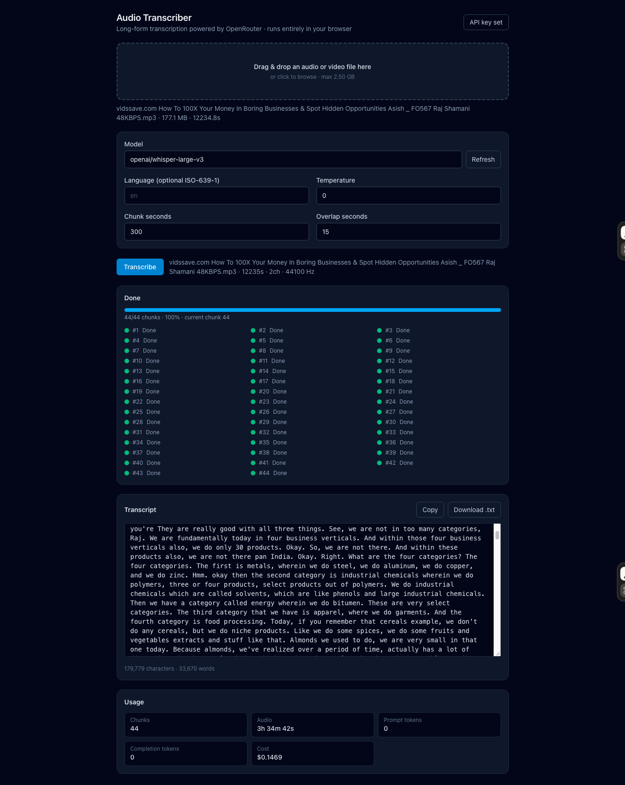
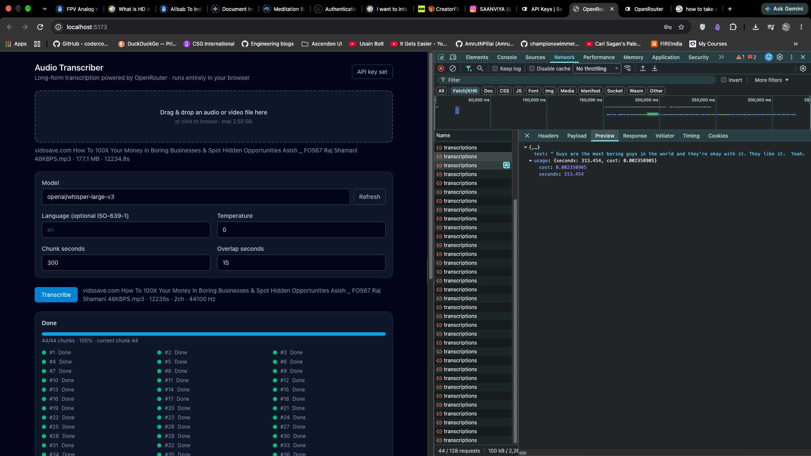

# OpenRouter Audio Transcriber



*Transcription in progress — drop a file, pick a model, and get a stitched transcript.*

A static single-page app that turns long audio files into a single stitched text
transcript. Everything runs in the browser — files are decoded, chunked, sent to
OpenRouter's transcription API, and reassembled into one transcript.

There is **no backend**. Your API key never leaves the browser and is transmitted
only to `openrouter.ai`.

## Features

- **Any common audio format** — `mp3`, `m4a`/`mp4`, `mov`, `wav`, `flac`, `ogg`,
  `opus`, `webm`, `mkv`, `aac`, `ts`.
- **Long files** — handles up to ~2 GB / ~4 hours without freezing the tab.
- **Smart chunking** — splits audio at silence boundaries, then stitches the
  transcripts back together with no lost or duplicated words.
- **BYOK** — paste your own OpenRouter API key; it's stored in memory by default,
  with an optional session-only toggle.
- **Cost summary** — shows aggregated usage and cost after each run.

## Getting started

### Prerequisites

- Node.js 18+
- A modern Chromium-based browser (Chrome or Edge recommended)
- An [OpenRouter API key](https://openrouter.ai/keys)

### Install & run

```bash
npm install
npm run dev
```

Then open the printed local URL, add your API key, drop in an audio file, and
click **Transcribe**.

## Scripts

| Command | Description |
|---|---|
| `npm run dev` | Start the dev server |
| `npm run build` | Type-check and build for production |
| `npm run preview` | Preview the production build |
| `npm run typecheck` | Run TypeScript checks only |
| `npm run lint` | Run ESLint |
| `npm run format` | Format with Prettier |
| `npm test` | Run the test suite |
| `npm run test:watch` | Run tests in watch mode |
| `npm run test:coverage` | Run tests with coverage |

## Tech stack

- **React 18 + TypeScript + Vite** — fast, simple static build
- **TailwindCSS** — styling
- **Zustand** — lightweight state for the pipeline
- **Mediabunny + WebCodecs** — streaming decode/encode without loading whole files
- **`@openrouter/sdk`** — transcription client (with a raw-`fetch` fallback)
- **Vitest** — unit and integration tests

## How it works

The pipeline runs as a small state machine:

```
idle → loading → planning → processing(chunk i/n) → stitching → done
                                                     ↘ error
                                                     ↘ cancelled
```

1. **Ingest** — validate the file and read its metadata (streams from disk, never
   loads it whole).
2. **Plan** — compute chunk boundaries (default 300 s chunks, 15 s overlap),
   snapped to silence.
3. **Decode & slice** — stream packets, downmix + resample to 16 kHz mono.
4. **Encode** — encode each slice to MP3 mono @ 64 kbps.
5. **Transcribe** — send chunks to OpenRouter (concurrency 2, retries with
   backoff).
6. **Stitch** — detect and remove overlapping text between adjacent chunks.
7. **Present** — read-only transcript with copy/download and a cost summary.

Media work runs inside a Web Worker so the UI stays responsive.



*The same run with DevTools open — showing the OpenRouter API calls and in-browser processing.*

## Project structure

```
src/
  components/   # UI: ApiKeyGate, Dropzone, SettingsPanel, ProgressPanel, ...
  features/
    stt/        # OpenRouter client, model catalog
    audio/      # decode, encode, chunk planner, worker
    stitch/     # transcript stitcher
    pipeline/   # orchestration
  state/        # Zustand store
  lib/          # base64, token helpers, key storage
  types.ts
tests/
docs/SDD.md    # full design document
```

## Security notes

- The API key is stored **in memory by default**. An optional toggle stores it in
  `sessionStorage` (cleared when you close the tab). `localStorage` is never used.
- For safety, create a **dedicated OpenRouter key with a spend limit** so a
  worst-case leak is financially capped.
- The key is sent **only to `openrouter.ai`** — there is no backend in the path.

See [`docs/SDD.md`](docs/SDD.md) for the full design documentation.

## Testing

```bash
npm test
```

Covers the chunk planner, silence detection, stitcher overlap logic, base64/token
helpers, key storage, and transcribe/retry behavior.

## License

MIT Licensed